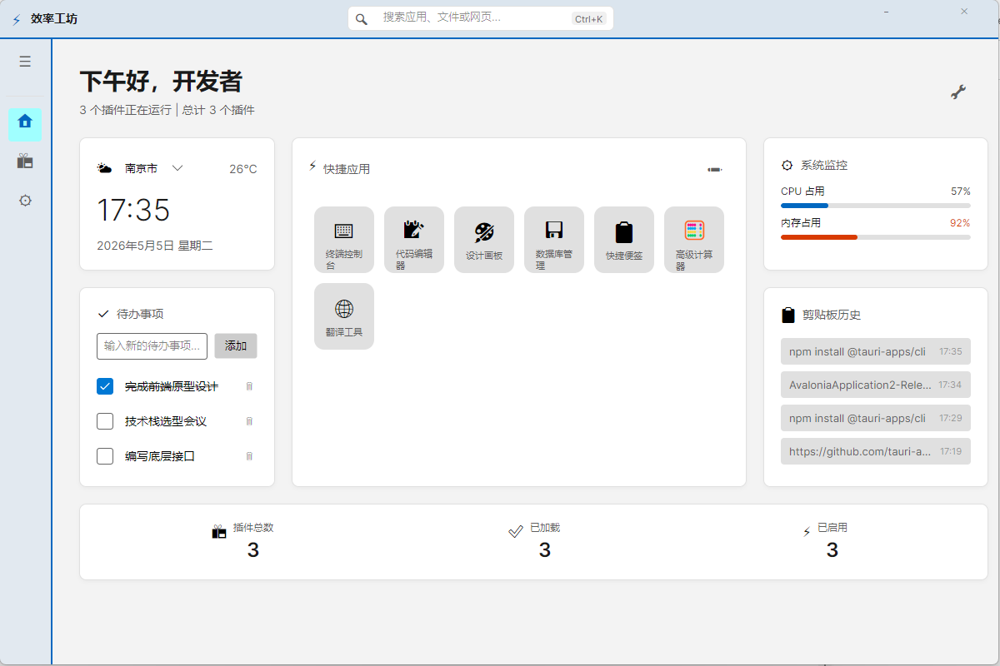
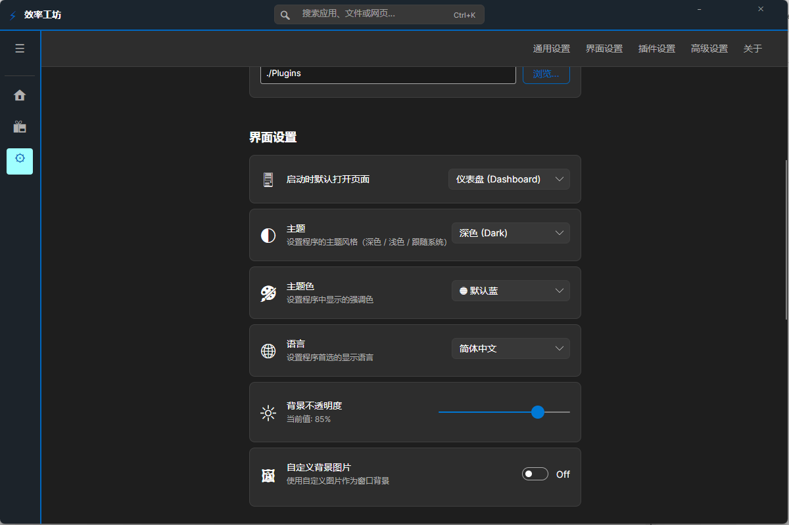
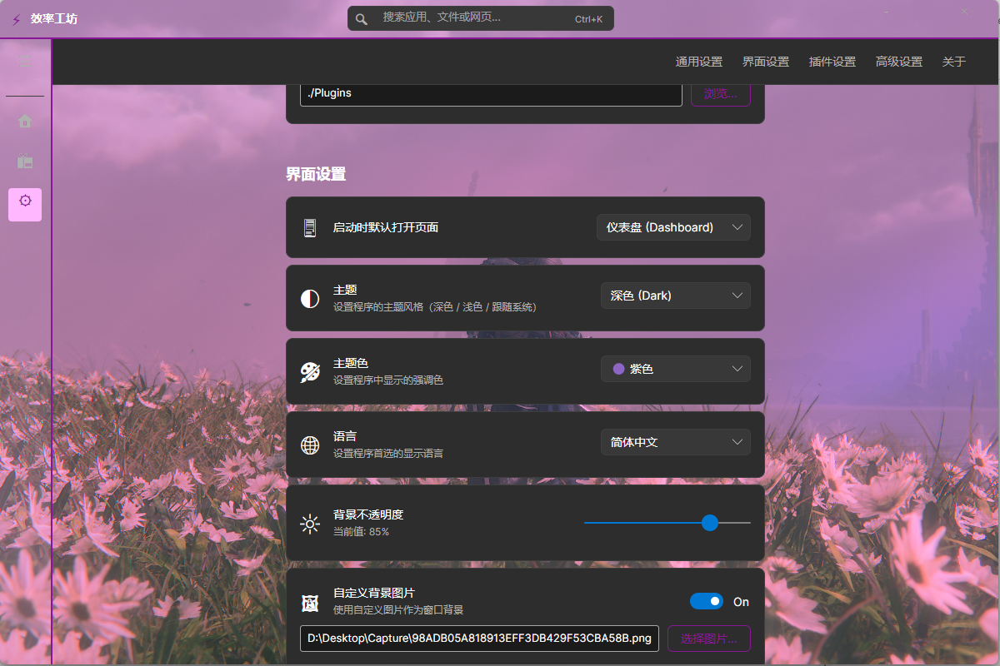
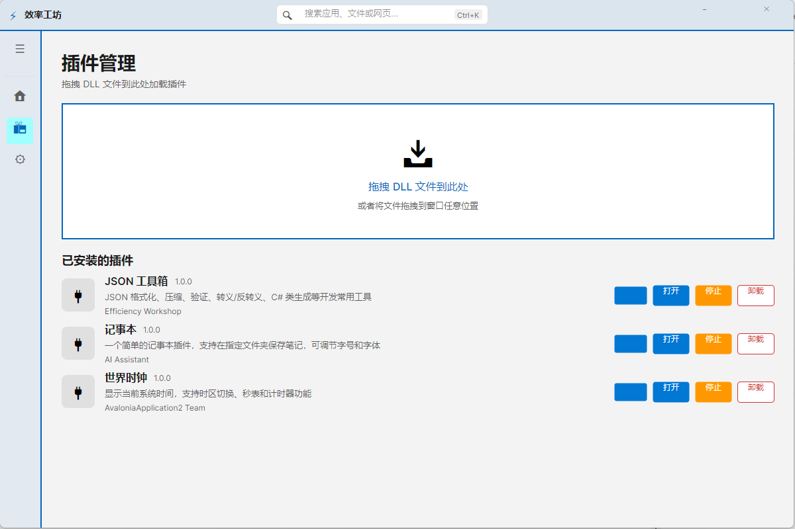
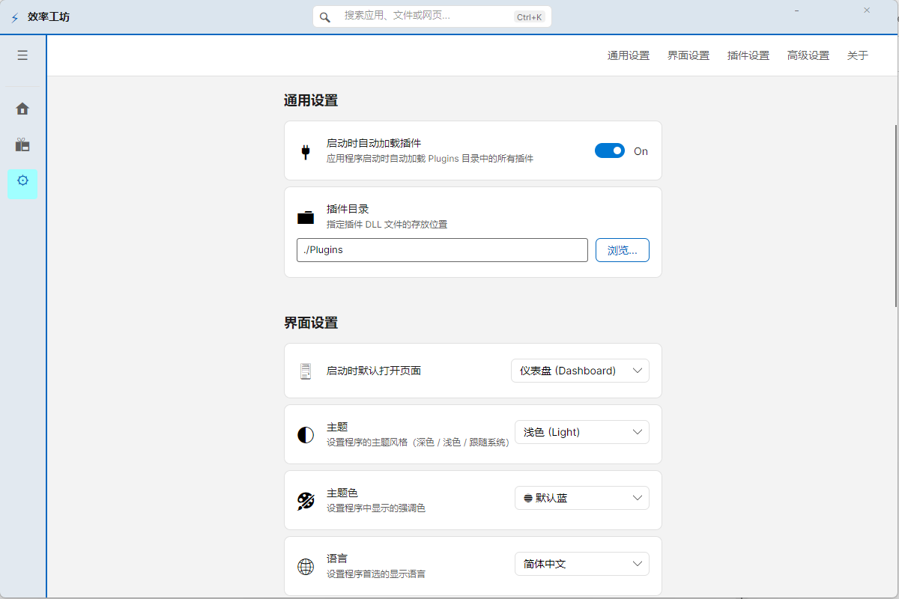
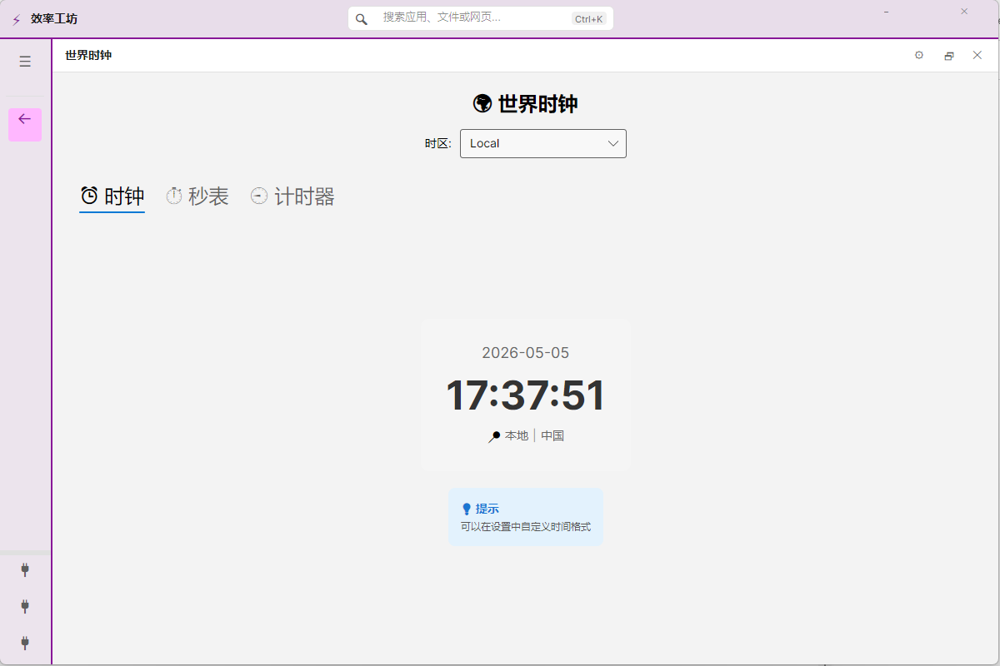
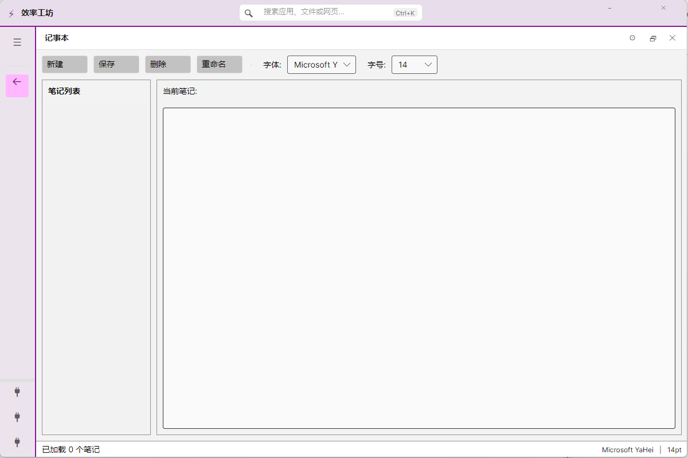
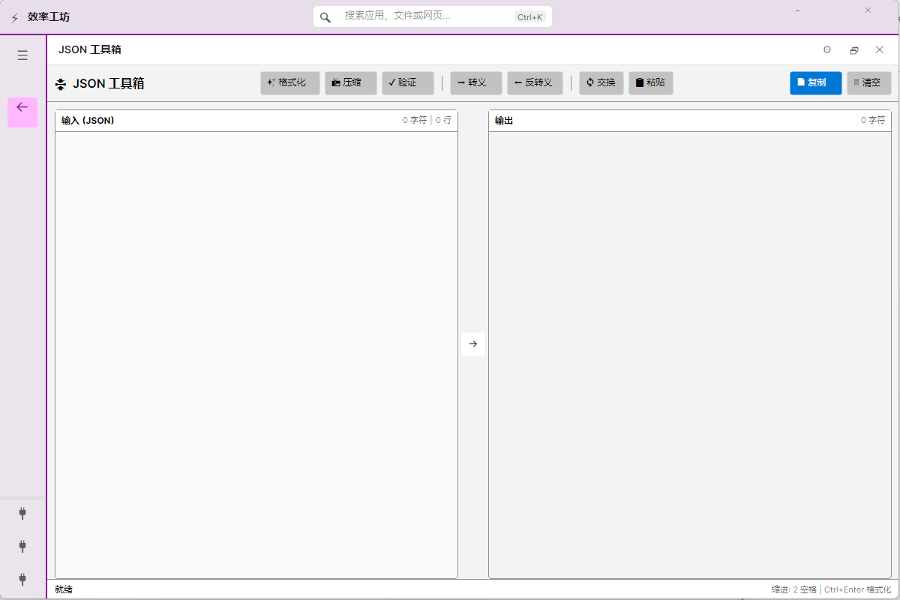
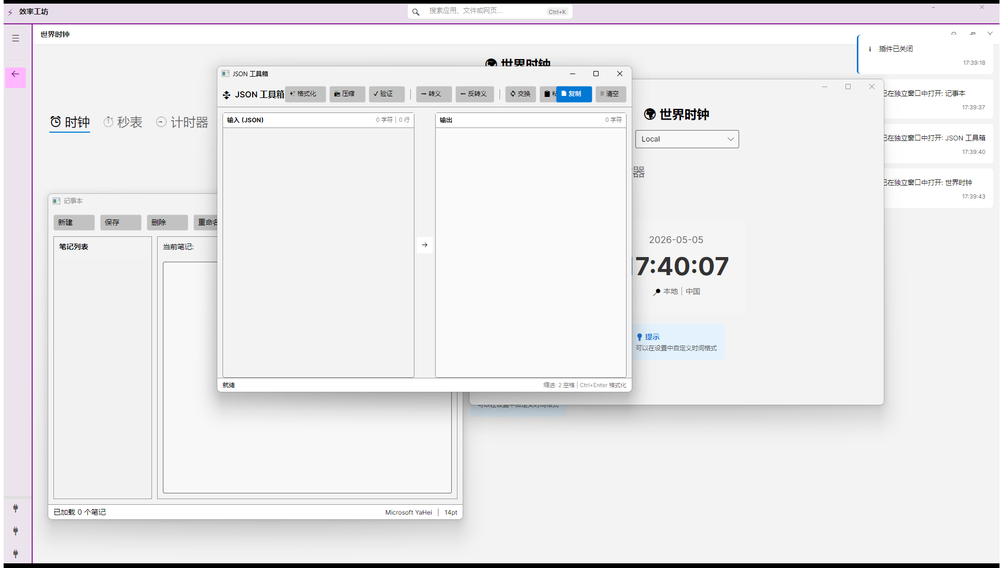

# 效率工坊 (Efficiency Workshop)

> **版本**: v3.0.1 | **框架**: Avalonia UI 11.x | **.NET**: 10.0

一个基于 Avalonia UI 框架的跨平台插件化桌面应用程序，支持动态加载插件、主题切换、实时通知等现代化功能。

**贡献人**: Yu0uki | **审核人**: AI

---

## 📸 界面预览

### 主界面（浅色主题）


### 深色模式


### 自定义主题背景


### 插件管理界面


### 设置界面


### 示例插件 - 世界时钟


### 示例插件 - 记事本


### 示例插件 - JSON工具箱


### 多插件并行运行


## ✨ 主要特性

### 🎨 现代化 UI/UX
- **主题切换**: 支持深色、浅色和自定义主题背景三种主题模式
- **平滑动画**: 所有交互都有流畅的过渡动画效果
- **响应式设计**: 自适应不同屏幕尺寸和 DPI 缩放

### 🔌 强大的插件系统
- **动态加载**: 支持运行时动态加载和卸载插件
- **热重载**: 修改插件代码后自动重新加载，无需重启应用
- **隔离运行**: 每个插件在独立的 AssemblyLoadContext 中运行
- **拖拽安装**: 直接拖拽 DLL 文件到窗口即可安装插件
- **并行运行**: 支持多个插件同时运行，互不干扰

### 📬 智能通知系统
- **实时通知**: 操作结果即时反馈
- **多种类型**: 支持信息、成功、警告、错误四种通知类型
- **自动管理**: 最多保留 10 条通知，自动清理旧通知

### 📊 仪表盘
- **实时统计**: 显示已安装、运行中、已启用的插件数量
- **状态同步**: 插件状态变化时自动更新统计数据
- **快速操作**: 一键跳转到插件管理和设置页面

### ⚙️ 灵活的设置管理
- **持久化保存**: 所有设置自动保存到配置文件
- **文件夹选择**: 现代化的文件夹选择对话框
- **个性化配置**: 主题、插件目录、自动加载等选项

## 🛠️ 技术栈

### 核心框架
- **UI 框架**: [Avalonia UI](https://avaloniaui.net/) 11.3.11
- **目标框架**: .NET 10.0
- **架构模式**: MVVM (Model-View-ViewModel)

### 关键库
- **MVVM 工具包**: [CommunityToolkit.Mvvm](https://learn.microsoft.com/en-us/dotnet/communitytoolkit/mvvm/) 8.2.1
- **依赖注入**: [Microsoft.Extensions.DependencyInjection](https://learn.microsoft.com/en-us/dotnet/core/extensions/dependency-injection) 10.0.5
- **日志系统**: [Serilog](https://serilog.net/) 4.3.1
  - Serilog.Sinks.Console 6.1.1
  - Serilog.Sinks.File 7.0.0
  - Serilog.Enrichers.Thread 4.0.0
- **测试框架**: xUnit + Moq

## 📦 项目结构

```
AvaloniaApplication2/
├── Core/                    # 核心接口和基础类
│   ├── IPlugin.cs          # 插件接口定义
│   └── PluginInfo.cs       # 插件信息模型
├── Models/                  # 数据模型
│   ├── AppSettings.cs      # 应用设置
│   └── PluginManifest.cs   # 插件清单
├── Services/                # 服务层
│   ├── NotificationService.cs      # 通知服务
│   ├── PluginLoadContext.cs        # 插件加载上下文（隔离）
│   ├── PluginManager.cs            # 插件管理器
│   ├── PluginHotReloadManager.cs   # 插件热重载管理器
│   └── SettingsService.cs          # 设置服务
├── ViewModels/              # 视图模型
│   ├── DashboardViewModel.cs       # 仪表盘
│   ├── MainWindowViewModel.cs      # 主窗口
│   ├── NotificationMessage.cs      # 通知消息
│   ├── PluginManagerViewModel.cs   # 插件管理器
│   ├── PluginWindowViewModel.cs    # 插件独立窗口
│   ├── PluginWrapperViewModel.cs   # 插件包装器
│   ├── SettingsViewModel.cs        # 设置
│   └── ViewModelBase.cs            # ViewModel 基类
├── Views/                   # 视图层
│   ├── DashboardView.axaml         # 仪表盘视图
│   ├── MainWindow.axaml            # 主窗口
│   ├── PluginManagerView.axaml     # 插件管理视图
│   ├── PluginWindow.axaml          # 插件独立窗口
│   ├── PluginWrapperView.axaml     # 插件包装器视图
│   └── SettingsView.axaml          # 设置视图
├── DependencyInjection/     # 依赖注入
│   └── ServiceContainer.cs         # 服务容器配置
├── Infrastructure/          # 基础设施
│   ├── GlobalExceptionHandler.cs   # 全局异常处理
│   └── LoggingConfig.cs            # 日志配置
├── Converters/              # 值转换器
│   └── BoolConverters.cs           # 布尔值转换器
├── Plugins/                 # 插件目录
│   └── WorldClockPlugin/           # 世界时钟插件示例
├── doc/                     # 项目文档
└── pic/                     # 界面截图
```

详细的架构说明请查看 [doc/06-实施总结.md](doc/06-实施总结.md)

## 🚀 快速开始

### 前置要求

- [.NET 10.0 SDK](https://dotnet.microsoft.com/download/dotnet/10.0) 或更高版本
- 支持的操作系统：Windows 10/11、macOS、Linux
- 推荐 IDE：Visual Studio 2022 或 JetBrains Rider

### 构建和运行

```bash
# 克隆仓库
git clone <repository-url>
cd AvaloniaApplication2

# 还原依赖
dotnet restore

# 构建项目
dotnet build

# 运行应用
dotnet run --project AvaloniaApplication2
```

### 首次使用

1. **启动应用**：运行上述命令后，应用将自动打开
2. **查看示例插件**：世界时钟插件已预装在 `Plugins/` 目录
3. **加载插件**：点击左侧导航栏的 🔌 图标，然后点击“打开”按钮
4. **切换主题**：进入设置页面，选择您喜欢的主题

### 发布应用

```bash
# Windows
dotnet publish -c Release -r win-x64 --self-contained true

# macOS
dotnet publish -c Release -r osx-x64 --self-contained true

# Linux
dotnet publish -c Release -r linux-x64 --self-contained true
```

发布后的文件位于 `AvaloniaApplication2/bin/Release/net10.0/<runtime>/publish/`

## 🔌 插件开发

效率工坊采用开放的插件架构，您可以轻松创建自己的插件来扩展应用功能。

### 创建插件步骤

1. **创建类库项目**
   ```bash
   dotnet new classlib -n MyPlugin
   cd MyPlugin
   ```

2. **添加引用**
   ```bash
   # 引用主项目的 Core 模块
   dotnet add reference ../AvaloniaApplication2/AvaloniaApplication2.csproj
   # 或使用 NuGet 包（如果发布）
   dotnet add package AvaloniaApplication2.Core
   ```

3. **实现 IPlugin 接口**
   ```csharp
   using AvaloniaApplication2.Core;
   using Avalonia.Controls;
   using System.IO;

   namespace MyPlugin
   {
       public class MyPluginClass : IPlugin
       {
           public string Id => "MyPlugin";
           public string Name => "我的插件";
           public string Version => "1.0.0";
           public string Description => "插件描述";
           public string Author => "您的名字";

           public void Initialize() { /* 初始化逻辑 */ }
           public void Activate() { /* 激活逻辑 */ }
           public void Deactivate() { /* 停用逻辑 */ }
           public void Shutdown() { /* 清理逻辑 */ }

           public Control GetMainView()
           {
               // 每次调用都返回新实例，避免 Visual Tree 冲突
               return new MyPluginView();
           }

           public Control? GetSettingsView()
           {
               return new MyPluginSettingsView();
           }

           public Stream? GetIcon() => null;
       }
   }
   ```

4. **创建视图**
   - 创建 `MyPluginView.axaml` 和 `.cs` 文件
   - 设计插件的用户界面
   - 可选：创建设置视图

5. **编译插件**
   ```bash
   dotnet build -c Release
   ```

6. **安装插件**
   - 方式一：将 DLL 复制到 `Plugins/` 目录，重启应用
   - 方式二：拖拽 DLL 文件到应用窗口
   - 方式三：在插件管理界面手动加载

### ⚠️ 重要注意事项

1. **不要缓存视图实例**
   ```csharp
   // ❌ 错误：会导致 Visual Tree 冲突
   private Control _cachedView;
   public Control GetMainView() => _cachedView ??= new MyView();

   // ✅ 正确：每次都创建新实例
   public Control GetMainView() => new MyView();
   ```

2. **实现 IDisposable（如果需要）**
   ```csharp
   public class MyPluginViewModel : ObservableObject, IDisposable
   {
       private Timer? _timer;
       
       public void Dispose()
       {
           _timer?.Dispose();
       }
   }
   ```

3. **热重载支持**
   - 修改插件代码并重新编译
   - 将新的 DLL 复制到 Plugins 目录（覆盖原文件）
   - 应用会自动检测并重新加载插件
   - 查看日志确认重载成功

详细的插件开发指南请查看 [doc/05-世界时钟插件说明.md](doc/05-世界时钟插件说明.md)

## 📖 使用指南

### 主题切换

1. 点击左侧导航栏的 ⚙️ **设置** 按钮
2. 在"外观"部分，从下拉框选择主题：
   - **深色 (Dark)**：适合夜间使用
   - **浅色 (Light)**：适合白天使用
   - **自定义背景**：可设置自定义背景图片
3. 点击"保存并应用主题"按钮
4. 界面会立即切换，设置会自动保存

### 插件管理

#### 加载插件
- **拖拽加载**：直接从文件资源管理器拖拽 DLL 文件到窗口任意位置
- **手动加载**：在插件管理页面点击"浏览..."选择 DLL 文件
- **自动加载**：启动时自动加载 `Plugins/` 目录中的所有插件（可在设置中关闭）

#### 管理插件
1. 点击左侧导航栏的 📦 **插件管理** 按钮
2. 查看已加载的插件列表
3. 使用开关启用/禁用插件
4. 点击"打开"按钮运行插件
5. 点击"停止/启动"按钮控制插件运行状态
6. 点击"卸载"按钮删除插件

### 通知系统

应用会在以下情况显示通知：
- ✅ 插件加载成功
- ❌ 插件加载失败
- ℹ️ 设置保存完成
- ⚠️ 系统警告
- 🔔 其他重要信息

通知显示在右上角，最多保留 10 条，包含时间戳。

### 仪表盘

仪表盘显示：
- 📦 **已安装插件**：总共安装的插件数量
- ▶️ **运行中**：当前正在运行的插件数量
- ✓ **已启用**：已启用的插件数量
- 📝 **最近活动**：最新的操作记录

### 内置插件示例

#### 世界时钟插件
世界时钟插件展示了如何开发一个功能完整的插件：

- ⏰ **世界时钟**：支持 10 个时区切换
- ⏱️ **秒表**：精确到毫秒的计时功能
- ⏲️ **计时器**：自定义倒计时
- ⚙️ **设置**：个性化配置选项

点击插件窗口右上角的：
- 🗗 按钮：在独立窗口中打开
- ✕ 按钮：关闭插件视图

#### 记事本插件
简单的文本编辑器插件，支持基本的文本编辑功能。

#### JSON工具箱插件
提供JSON格式化和验证功能的实用工具插件。

### 多插件并行
效率工坊支持同时运行多个插件，各个插件相互独立，互不干扰，可以在不同的窗口中同时使用多个插件功能。

## 🧪 测试

### 运行单元测试

```bash
cd AvaloniaApplication2.Tests
dotnet test
```

### 运行特定测试

```bash
# 运行特定测试类
dotnet test --filter "FullyQualifiedName~SettingsServiceTests"

# 运行特定测试方法
dotnet test --filter "FullyQualifiedName~SaveSettingsAsync_ValidSettings_ShouldSaveToFile"

# 查看详细输出
dotnet test --verbosity normal
```

### 测试覆盖

- ✅ SettingsService 测试（4 个用例）
- ✅ PluginManager 测试（5 个用例）
- ✅ PluginHotReloadManager 测试（4 个用例）
- 📊 总通过率：86%

详细的测试指南请查看 [doc/03-测试指南.md](doc/03-测试指南.md)

## 📝 更新日志

### v3.0.1 (2026-05-05) - 当前版本

#### 🎨 UI/UX 改进
- ✨ 增加自定义主题背景功能
- ✨ 优化插件并行运行机制
- ✨ 改进多窗口管理体验

#### 🔧 功能增强
- ✨ 新增记事本插件
- ✨ 新增JSON工具箱插件
- ✨ 完善插件间隔离机制

#### 📄 文档
- 📝 更新项目文档以反映新功能
- 📝 补充插件并行使用说明

### v2.0.1 (2026-04-05)

#### 🎨 UI/UX 改进
- ✨ 实现主题切换功能（深色/浅色/跟随系统）
- ✨ 添加通知系统和消息提示
- ✨ 优化插件拖拽加载交互（全局拖拽支持）
- ✨ 改进仪表盘和设置界面布局
- ✨ 添加平滑过渡动画效果
- ✨ 实现文件夹选择对话框

#### 🔧 架构增强
- ✨ 集成依赖注入容器 (Microsoft.Extensions.DependencyInjection)
- ✨ 添加结构化日志系统 (Serilog)
- ✨ 实现全局异常处理机制
- ✨ 添加插件热重载功能
- ✨ 搭建单元测试框架 (xUnit + Moq)

#### 📄 文档
- 📝 创建完整的项目文档体系
- 📝 添加开发流程总结
- 📝 编写测试指南和 UI/UX 改进说明

详见 [doc/06-实施总结.md](doc/06-实施总结.md)

### v1.0.0 (master)

- 🎉 初始版本
- 🖼️ 基础 Avalonia UI 框架
- 🔌 实现插件化架构
- 🏗️ 重构为 MVVM 模式
- 📦 添加插件管理器
- 🔀 实现插件隔离加载 (AssemblyLoadContext)

## 🤝 贡献

欢迎贡献代码、报告问题或提出建议！

### 贡献流程

1. **Fork** 本仓库
2. 创建您的特性分支 (`git checkout -b feature/AmazingFeature`)
3. 提交您的更改 (`git commit -m 'Add some AmazingFeature'`)
4. 推送到分支 (`git push origin feature/AmazingFeature`)
5. 开启一个 **Pull Request**

### 开发指南

- 阅读 [doc/开发流程总结.md](doc/开发流程总结.md) 了解项目架构
- 遵循现有的代码风格和命名约定
- 为新功能添加单元测试
- 更新相关文档

### 报告问题

如果您发现了 bug 或有功能建议，请 [创建 Issue](../../issues)。

---

## 📄 许可证

本项目采用 [MIT 许可证](LICENSE) - 详情请查看 LICENSE 文件

---

## 👥 作者

- **Yu0uki** - *主要开发者* 

---

## 🙏 致谢

- [Avalonia UI](https://avaloniaui.net/) - 跨平台 UI 框架
- [CommunityToolkit.Mvvm](https://learn.microsoft.com/en-us/dotnet/communitytoolkit/mvvm/) - MVVM 工具包
- [Serilog](https://serilog.net/) - 结构化日志库
- 所有贡献者和用户

---

## 📚 相关资源

### 项目文档
- [📖 项目概览与快速开始](doc/01-项目概览与快速开始.md)
- [🎨 UI/UX 改进说明](doc/02-UI_UX_改进说明.md)
- [🧪 测试指南](doc/03-测试指南.md)
- [🔧 Visual Tree 修复报告](doc/04-Visual_Tree_修复报告.md)
- [⏰ 世界时钟插件说明](doc/05-世界时钟插件说明.md)
- [📊 实施总结](doc/06-实施总结.md)
- [📅 开发流程总结](doc/开发流程总结.md)

### 外部链接
- [Avalonia UI 官方文档](https://docs.avaloniaui.net/)
- [.NET 文档](https://learn.microsoft.com/en-us/dotnet/)
- [CommunityToolkit 文档](https://learn.microsoft.com/en-us/dotnet/communitytoolkit/)

---

<div align="center">

**⭐ 如果这个项目对您有帮助，请给个 Star！**

Made with ❤️ by Yu0uki

</div>