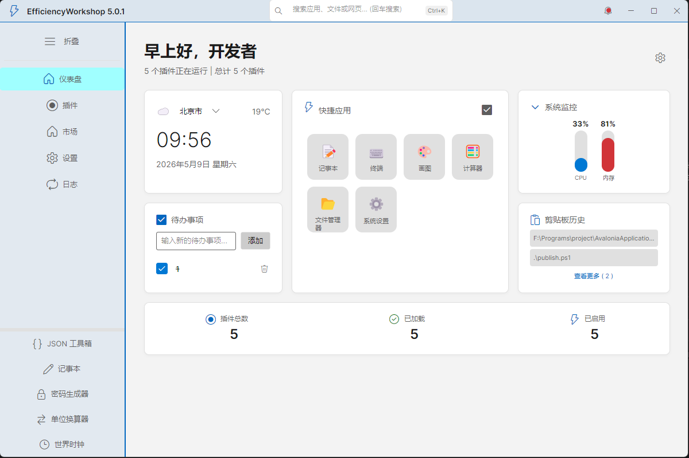
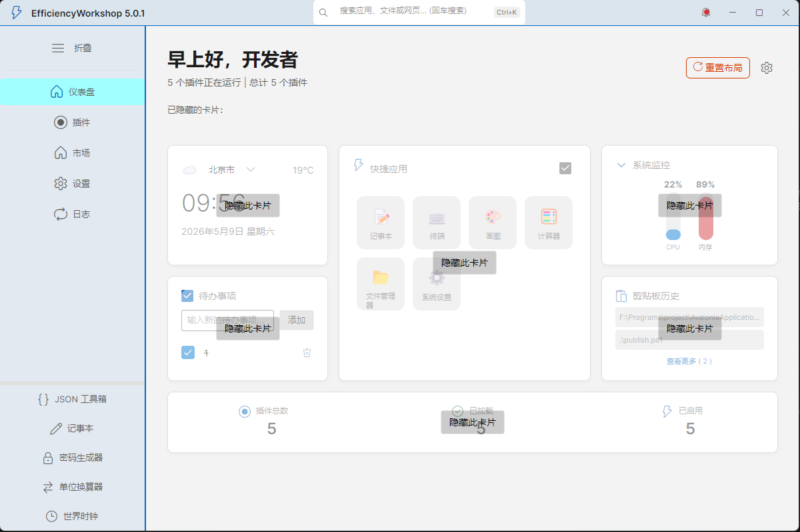
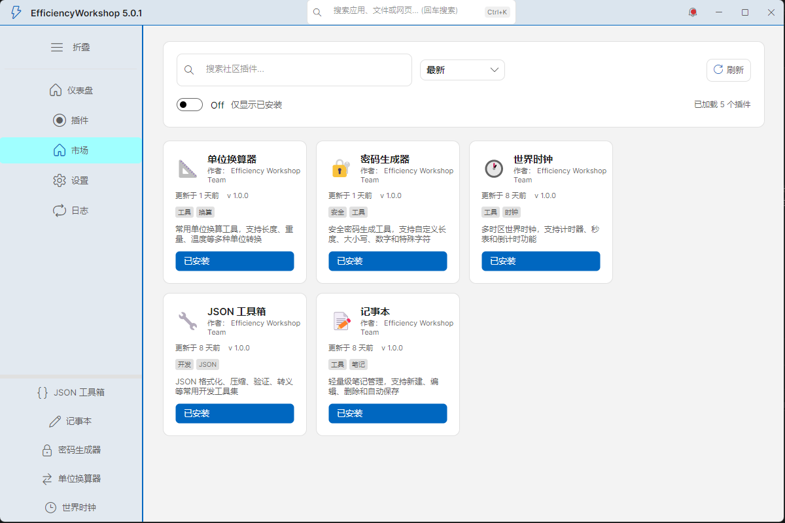
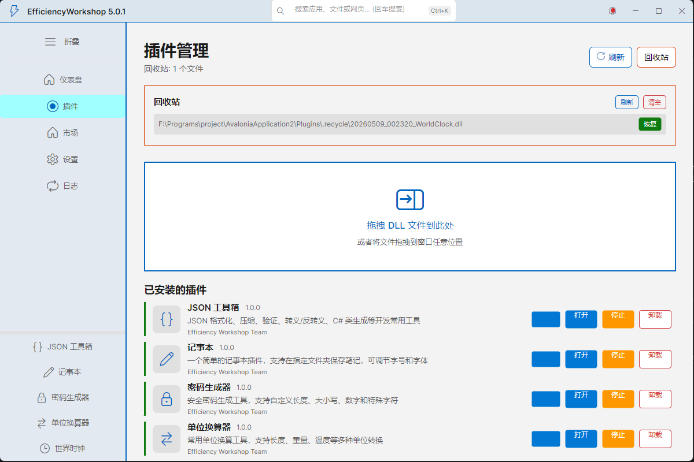
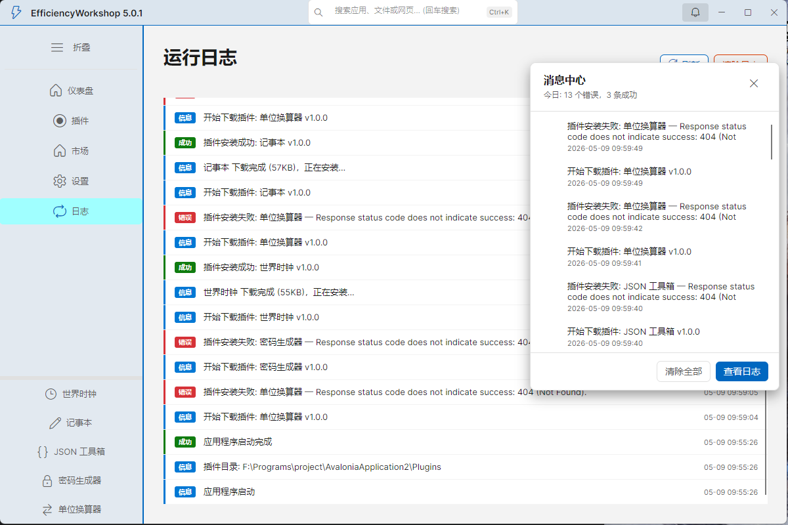
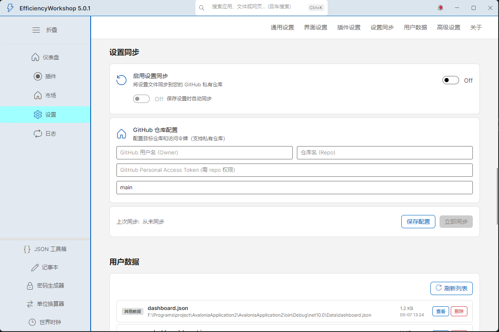

# 效率工坊 (Efficiency Workshop)

> **版本**: v5.0.1 | **框架**: Avalonia UI 11.3.11 | **.NET**: 10.0

一个基于 Avalonia UI 的跨平台插件化桌面效率工具，支持插件市场、动态加载、主题切换、云端同步等现代化功能。

**开发者**: Yu0uki

---

## 界面预览

### 主界面（默认风格）


### 主界面（自定义布局）


### 主题更换


### 插件市场


### 插件管理


### 日志系统


### 设置 - 云端同步


---

## 主要特性

### UI / UX
- **Win11 Fluent Design**: Segoe Fluent Icons 图标系统、圆角窗口控件、Mica/Acrylic 材质
- **主题切换**: 深色 / 浅色双主题，0.3s 平滑过渡动画
- **可折叠侧边栏**: 支持展开/折叠，持久化侧边栏宽度
- **搜索栏**: Ctrl+K 快捷聚焦，支持搜索历史记录（可清除）
- **通知中心**: 铃铛图标 + 红点徽章，弹出面板显示最近 50 条通知历史
- **剪贴板历史**: 仪表盘内嵌剪贴板监控卡片

### 仪表盘
- **系统性能监控**: CPU / 内存使用率垂直条形指示器，颜色随负载变化
- **天气显示**: 实时天气信息卡片
- **快捷应用**: 中文名称、去重管理、一键启动
- **插件统计**: 实时显示已安装 / 运行中 / 已启用数量

### 插件系统
- **动态加载**: 运行时加载/卸载，独立 AssemblyLoadContext 隔离运行
- **内存加载**: DLL 从内存加载，不锁定文件，支持无残留卸载
- **插件市场**: 连接 GitHub 仓库，浏览/搜索/安装远程插件
- **拖拽安装**: 直接拖拽 DLL 文件到窗口即可安装
- **热重载**: 插件 DLL 更新后自动检测并重新加载
- **安全扫描**: 加载前对 DLL 进行模式扫描（SHA256 + 危险 API 检测）
- **独立窗口**: 插件可弹出为独立窗口运行
- **回收站**: 卸载的插件移入回收站，支持恢复和清空

### 内置插件
| 插件 | 说明 |
|------|------|
| 世界时钟 | 多时区模拟时钟、秒表、倒计时 |
| 记事本 | 轻量级笔记管理，支持新建/编辑/删除 |
| JSON 工具箱 | JSON 格式化、压缩、验证 |
| 单位换算器 | 长度、重量、温度单位转换 |
| 密码生成器 | CSPRNG 安全密码生成，强度评估 |

### 设置管理
- **原子写入**: SemaphoreSlim + .tmp 交换，防止并发写入损坏配置
- **云端同步**: 设置同步到 GitHub 私有仓库（Bearer Token 认证）
- **用户数据管理**: 查看/导出/删除持久化的 JSON 数据文件
- **日志系统**: Serilog 结构化日志，文件 + 控制台双输出
- **个性化**: 主题、强调色、背景透明度、插件自动加载等

---

## 技术栈

### 核心框架
- **UI 框架**: [Avalonia UI](https://avaloniaui.net/) 11.3.11
- **目标框架**: .NET 10.0
- **架构模式**: MVVM (Model-View-ViewModel)

### 关键库
| 库 | 版本 | 用途 |
|----|------|------|
| CommunityToolkit.Mvvm | 8.2.1 | MVVM 工具包（源代码生成器） |
| Microsoft.Extensions.DependencyInjection | 10.0.5 | 依赖注入 |
| Serilog | 4.3.1 | 结构化日志 |
| Serilog.Sinks.Console | 6.1.1 | 控制台日志输出 |
| Serilog.Sinks.File | 7.0.0 | 文件日志输出 |

---

## 项目结构

```
├── Core/                          # 核心接口与基础类
│   ├── IPlugin.cs                 # 插件接口定义
│   ├── FluentIcons.cs             # Segoe Fluent Icons 常量
│   └── PluginInfo.cs              # 插件信息模型
├── Models/                        # 数据模型
│   ├── AppSettings.cs             # 应用设置（含迁移）
│   └── RemotePluginInfo.cs        # 远程插件信息
├── Services/                      # 服务层
│   ├── PluginManager.cs           # 插件生命周期管理
│   ├── PluginLoadContext.cs       # 隔离加载上下文
│   ├── PluginHotReloadManager.cs  # 热重载监视
│   ├── PluginSecurityService.cs   # 插件安全扫描
│   ├── NotificationService.cs     # 通知服务
│   ├── SettingsService.cs         # 设置持久化（原子写入）
│   ├── SettingsSyncService.cs     # GitHub 云端同步
│   └── ClipboardService.cs        # 剪贴板历史服务
├── ViewModels/                    # 视图模型
│   ├── MainWindowViewModel.cs     # 主窗口（通知中心/搜索/导航）
│   ├── DashboardViewModel.cs      # 仪表盘（性能监控/天气/快捷应用）
│   ├── PluginManagerViewModel.cs  # 插件管理（含回收站）
│   ├── PluginMarketViewModel.cs   # 插件市场
│   ├── PluginWrapperViewModel.cs  # 插件内嵌包装器
│   ├── PluginWindowViewModel.cs   # 插件独立窗口
│   ├── SettingsViewModel.cs       # 设置页面
│   ├── LogsViewModel.cs           # 日志查看
│   └── NotificationMessage.cs     # 通知消息模型
├── Views/                         # 视图层 (AXAML)
│   ├── MainWindow.axaml           # 主窗口布局
│   ├── DashboardView.axaml        # 仪表盘
│   ├── PluginManagerView.axaml    # 插件管理
│   ├── PluginMarketplaceView.axaml # 插件市场
│   ├── PluginWrapperView.axaml    # 插件包装器
│   ├── PluginWindow.axaml         # 插件独立窗口
│   ├── SettingsView.axaml         # 设置页面
│   └── LogsView.axaml             # 日志页面
├── Converters/                    # 值转换器
│   ├── PluginStatusBorderBrushConverter.cs
│   ├── PluginIconConverter.cs
│   └── LogTypeColorConverter.cs
├── DependencyInjection/
│   └── ServiceContainer.cs        # DI 容器配置
├── Infrastructure/
│   ├── GlobalExceptionHandler.cs  # 全局异常处理
│   └── LoggingConfig.cs           # Serilog 配置
├── Plugins/                       # 插件目录
│   ├── WorldClockPlugin/
│   ├── NotepadPlugin/
│   ├── JsonToolboxPlugin/
│   ├── UnitConverterPlugin/
│   ├── PasswordGeneratorPlugin/
│   ├── Template/                  # 插件模板
│   └── index.json                 # 本地市场索引
├── doc/                           # 项目文档
└── pic/                           # 界面截图
```

---

## 快速开始

### 前置要求
- [.NET 10.0 SDK](https://dotnet.microsoft.com/download/dotnet/10.0)
- Windows 10/11（推荐）、macOS、Linux

### 构建和运行

```bash
git clone <repository-url>
cd AvaloniaApplication2

# 还原依赖
dotnet restore

# 构建
dotnet build

# 运行
dotnet run --project AvaloniaApplication2
```

### 发布

```bash
# Windows x64
dotnet publish -c Release -r win-x64 --self-contained true

# macOS
dotnet publish -c Release -r osx-x64 --self-contained true

# Linux
dotnet publish -c Release -r linux-x64 --self-contained true
```

发布输出: `AvaloniaApplication2/bin/Release/net10.0/<runtime>/publish/`

---

## 插件开发

### 快速开始

1. 复制 `Plugins/Template/` 作为新项目
2. 实现 `IPlugin` 接口
3. 创建视图 (AXAML) 和 ViewModel
4. 编译 DLL 放入 `Plugins/` 目录或通过插件市场分发

### IPlugin 接口

```csharp
public interface IPlugin
{
    string Id { get; }          // 唯一标识符
    string Name { get; }        // 显示名称
    string Version { get; }     // 版本号
    string Description { get; } // 描述
    string Author { get; }      // 作者

    void Initialize();          // 初始化
    void Activate();            // 激活（显示时调用）
    void Deactivate();          // 停用（隐藏时调用）
    void Shutdown();            // 清理

    Control GetMainView();      // 主视图（每次新建实例）
    Control? GetSettingsView(); // 设置视图（可选）
    Stream? GetIcon();          // 图标（可选）
}
```

### 注意事项
- `GetMainView()` 每次调用都返回新实例，禁止缓存
- 插件在独立 `AssemblyLoadContext` 中运行，类型不共享
- `[RelayCommand]` 方法必须为 `public`

---

## 更新日志

### v5.0.1 (2026-05-09)

**插件系统**
- 新增插件市场（GitHub 仓库集成，支持搜索/安装/本地回退）
- 新增内置插件：单位换算器、密码生成器
- 回收站功能：卸载插件移入回收站，支持恢复和清空
- 插件安全扫描（SHA256 + 危险 API 模式检测）
- DLL 从内存加载，消除文件锁定问题

**UI / UX**
- Segoe Fluent Icons 图标系统（替换 Emoji）
- Win11 Fluent Design 窗口控件（圆角、Mica 材质）
- 通知中心：铃铛图标 + 红点徽章 + 历史记录弹出面板
- 搜索栏历史记录下拉浮层
- 侧边栏可折叠，含文字标签
- 系统监控卡片（垂直条形指示器，颜色随负载变化）
- 日志页面类型彩色徽章

**设置与数据**
- 设置云端同步（GitHub Contents API + Token 认证）
- 用户数据管理（查看/删除持久化文件）
- 原子写入防配置损坏
- 配置版本迁移机制
- 关于页面重构（可点击链接）

**稳定性**
- 插件状态变更统一 UI 线程派发
- 回收站文件删除含重试与 GC 清理
- 插件卸载完全清理上下文
- 全局异常处理与日志覆盖

### v3.0.1 (2026-05-07)
- 优化拖拽频闪
- 优化插件载入逻辑
- 增设主页搜索框功能
- 完善快捷启动应用功能
- 修复主页天气异常

### v3.0.1 (2026-05-05)
- 自定义主题背景、插件并行运行
- 新增记事本、JSON 工具箱插件

### v2.0.1 (2026-04-05)
- 主题切换、通知系统、拖拽加载
- 依赖注入、Serilog 日志、热重载

### v1.0.0
- 初始版本：MVVM 架构、插件化框架、AssemblyLoadContext 隔离

---

## 许可证

MIT License

---

<div align="center">

**如果这个项目对您有帮助，请给个 Star**

Made by Yu0uki

</div>
