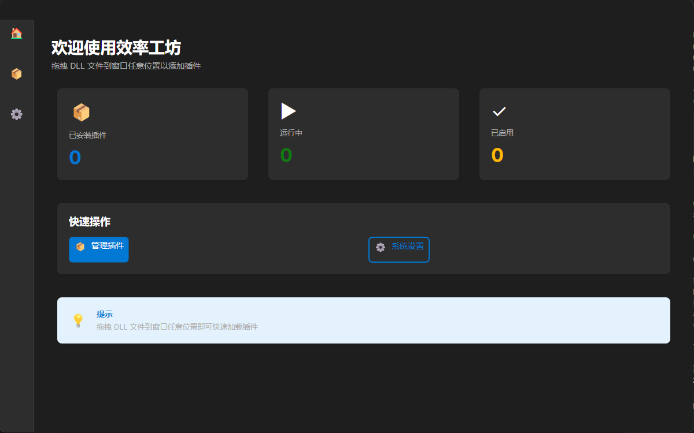
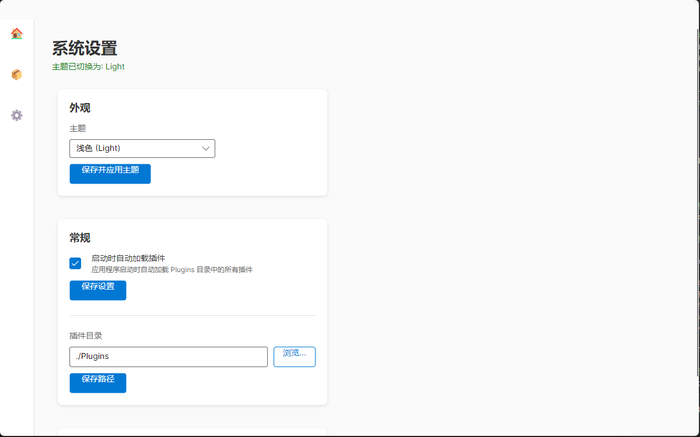

# AvaloniaApplication2

一个基于 Avalonia UI 框架的跨平台插件化桌面应用程序。

## 📸 界面预览

### 主界面


### 功能展示


## ✨ 主要特性

- 🎨 **现代化 UI/UX** - 支持浅色/深色主题切换
- 🔌 **插件化架构** - 支持动态加载和管理插件
- 📬 **通知系统** - 实时消息通知和提醒
- 🖱️ **拖拽交互** - 直观的拖拽式插件加载
- 📊 **仪表盘** - 清晰的应用状态概览
- ⚙️ **设置管理** - 灵活的配置选项

## 🛠️ 技术栈

- **UI 框架**: Avalonia UI 11.x
- **架构模式**: MVVM (Model-View-ViewModel)
- **依赖注入**: Microsoft.Extensions.DependencyInjection
- **状态管理**: CommunityToolkit.Mvvm
- **目标框架**: .NET 10.0

## 📦 项目结构

```
AvaloniaApplication2/
├── Core/                    # 核心接口和基础类
│   ├── IPlugin.cs          # 插件接口定义
│   └── PluginInfo.cs       # 插件信息模型
├── Models/                  # 数据模型
│   ├── AppSettings.cs      # 应用设置
│   └── PluginManifest.cs   # 插件清单
├── Services/                # 服务层
│   ├── NotificationService.cs    # 通知服务
│   ├── PluginLoadContext.cs      # 插件加载上下文
│   ├── PluginManager.cs          # 插件管理器
│   └── SettingsService.cs        # 设置服务
├── ViewModels/              # 视图模型
│   ├── DashboardViewModel.cs
│   ├── MainWindowViewModel.cs
│   ├── NotificationMessage.cs
│   ├── PluginManagerViewModel.cs
│   ├── SettingsViewModel.cs
│   └── ViewModelBase.cs
├── Views/                   # 视图层
│   ├── DashboardView.axaml
│   ├── MainWindow.axaml
│   ├── PluginManagerView.axaml
│   └── SettingsView.axaml
└── Plugins/                 # 插件目录
```

## 🚀 快速开始

### 前置要求

- [.NET 10.0 SDK](https://dotnet.microsoft.com/download/dotnet/10.0) 或更高版本
- 支持的操作系统：Windows、macOS、Linux

### 构建和运行

```bash
# 克隆仓库
git clone <repository-url>
cd AvaloniaApplication2

# 还原依赖
dotnet restore

# 构建项目
dotnet build

# 运行应用
dotnet run --project AvaloniaApplication2
```

### 发布应用

```bash
# Windows
dotnet publish -c Release -r win-x64 --self-contained true

# macOS
dotnet publish -c Release -r osx-x64 --self-contained true

# Linux
dotnet publish -c Release -r linux-x64 --self-contained true
```

## 🔌 插件开发

### 创建插件

1. 创建新的类库项目
2. 引用主项目的 `Core` 模块
3. 实现 `IPlugin` 接口
4. 创建插件清单文件 `plugin.json`

### 插件清单示例

```json
{
  "Name": "MyPlugin",
  "Version": "1.0.0",
  "Description": "我的插件描述",
  "Author": "Your Name",
  "MainAssembly": "MyPlugin.dll",
  "MainType": "MyPlugin.PluginClass"
}
```

### 加载插件

- **方式一**: 将插件文件夹放入 `Plugins` 目录，启动时自动加载
- **方式二**: 在主界面拖拽插件文件夹到指定区域
- **方式三**: 在插件管理器中手动选择插件目录

## 📖 使用指南

### 主题切换

点击左上角的主题切换按钮，可在浅色和深色模式之间切换。

### 插件管理

1. 导航到"插件管理"页面
2. 查看已加载的插件列表
3. 启用/禁用插件
4. 卸载不需要的插件

### 通知系统

应用会在以下情况显示通知：
- 插件加载成功/失败
- 设置保存完成
- 系统错误或警告

## 🧪 测试

详细的测试指南请查看 [TESTING_GUIDE.md](TESTING_GUIDE.md)

```bash
# 运行单元测试
dotnet test

# 运行集成测试
dotnet test --filter "Category=Integration"
```

## 📝 更新日志

### v3.0.0 (dev-v3)
- ✨ 实现主题切换功能（浅色/深色模式）
- ✨ 添加通知系统和消息提示
- ✨ 优化插件拖拽加载交互
- ✨ 改进仪表盘和设置界面布局
- 📄 新增 TESTING_GUIDE.md 和 UI_UX_Improvements.md

### v2.0.0 (dev-v2)
- 🔌 实现插件化架构
- 🏗️ 重构为 MVVM 模式
- 📦 添加插件管理器

### v1.0.0 (master)
- 🎉 初始版本

## 🤝 贡献

欢迎提交 Issue 和 Pull Request！

## 📄 许可证

本项目采用 MIT 许可证

## 👥 作者


