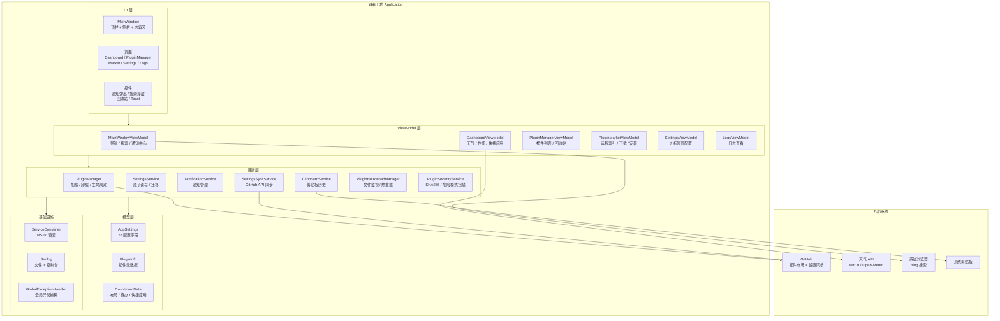
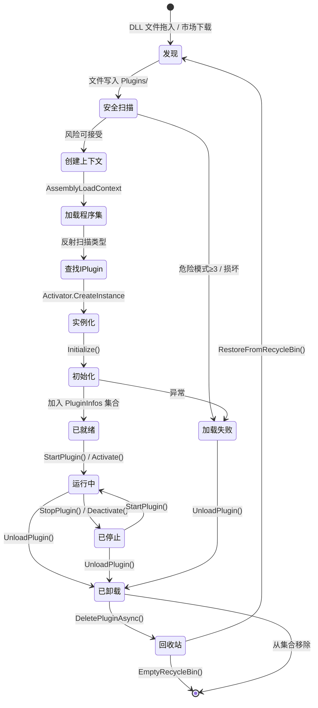
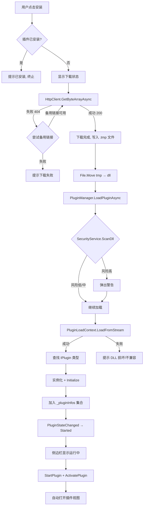
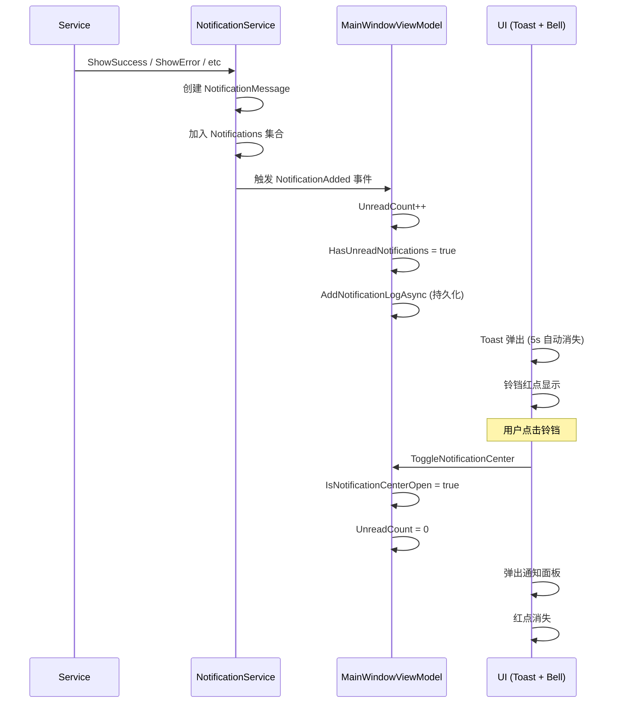
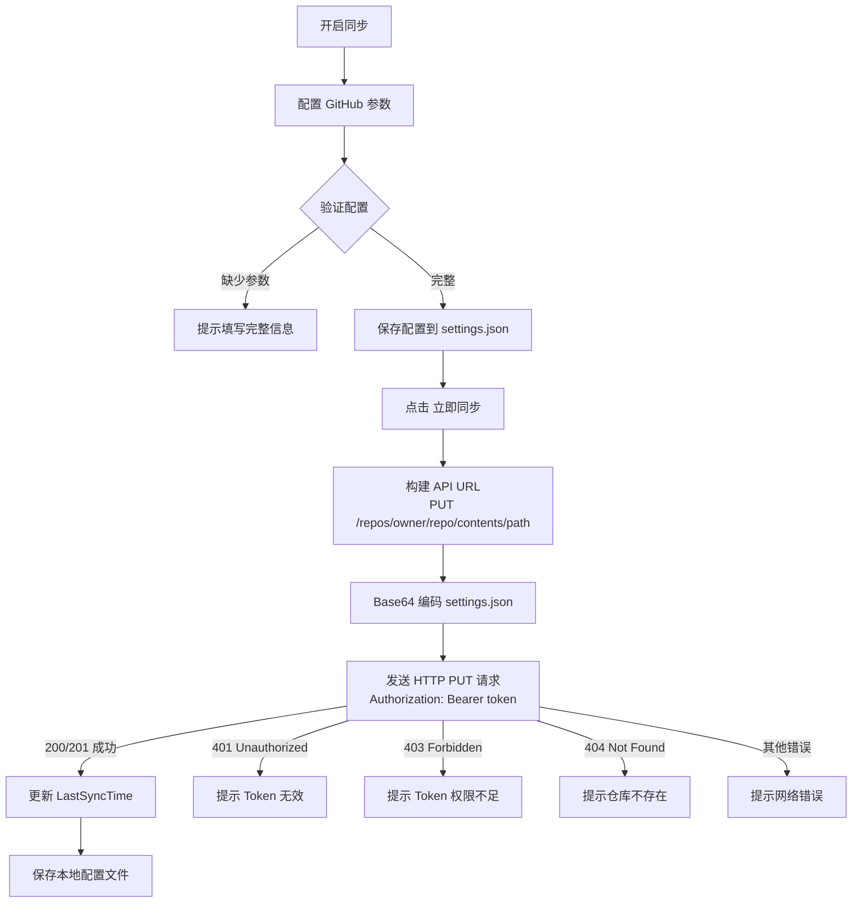
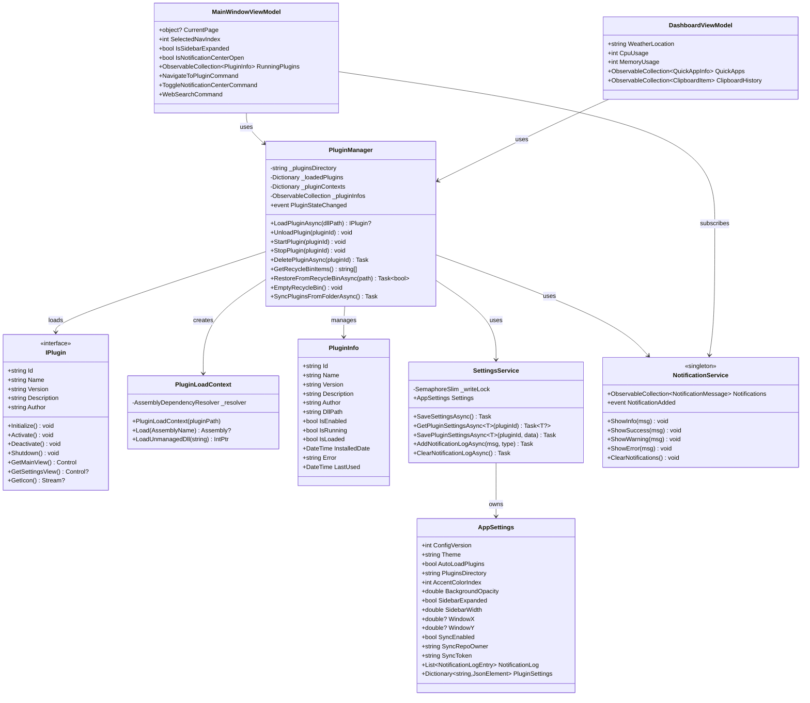
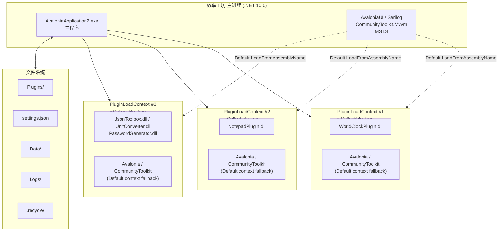

# 效率工坊 (Efficiency Workshop) — 软件使用说明

> **版本**: v5.0.1 | **编制日期**: 2026-05-24 | **编制人**: Yu0uki

---

## 目录

1. [软件概述](#1-软件概述)
2. [快速入门](#2-快速入门)
3. [功能详解](#3-功能详解)
4. [插件系统](#4-插件系统)
5. [设置管理](#5-设置管理)
6. [数据管理](#6-数据管理)
7. [软件设计](#7-软件设计)
8. [附录](#8-附录)

---

## 1. 软件概述

### 1.1 简介

"效率工坊"（Efficiency Workshop）是一款基于 Avalonia UI 的跨平台、插件化桌面效率工具。它提供了统一的可扩展平台，以插件形式集成多种效率工具（时钟、记事本、JSON 工具、单位换算器等），支持插件市场在线安装、云端设置同步、丰富的主题定制等功能。

### 1.2 核心特性一览

| 特性 | 说明 |
|------|------|
| 插件化架构 | 运行时动态加载/卸载 DLL 插件，独立 AssemblyLoadContext 隔离运行 |
| 插件市场 | 连接 GitHub 仓库，浏览、搜索、在线安装插件 |
| 主题系统 | 深色/浅色双主题，5 种强调色，0.3s 平滑过渡动画 |
| 通知中心 | 铃铛图标红点徽章，50 条历史记录弹出面板 |
| 仪表盘 | 系统性能监控、天气、快捷应用、剪贴板历史、待办事项 |
| 云端同步 | 设置同步到 GitHub 私有仓库（Bearer Token 认证） |
| 回收站 | 卸载的插件移入回收站，支持恢复和清空 |
| 安全扫描 | 插件加载前 SHA256 + 危险 API 模式检测 |


### 1.3 主界面概览

<!-- 截图：主界面-默认风格.jpg -->
> **图 1-1 主界面（默认风格）**

<!-- 截图：主界面-自定义布局.jpg -->
> **图 1-2 主界面（自定义布局）**

主界面由以下区域组成：

```
┌─────────────────────────────────────────────────────────────┐
│  Logo    [=========搜索栏=========]  [铃铛]  [─][□][✕]       │  ← 顶栏 (40px)
├────────┬────────────────────────────────────────────────────┤
│ 导航栏 │                                                      │
│        │                                                    │
│ 仪表盘 │                                                      │
│ 插件   │             内容区域 (ContentControl)                 │
│ 市场   │                                                      │
│ 设置   │                                                      │
│ 日志   │                                                      │
│        │                                                    │
│ ────── │                                                      │
│ 运行中 │                                                      │
│ 插件A  │                                                      │
│ 插件B  │                                                      │
│        │                                                    │
├────────┴────────────────────────────────────────────────────┤
│                      状态栏                                    │
└─────────────────────────────────────────────────────────────┘
```

---

## 2. 快速入门

### 2.1 环境要求

| 组件 | 最低要求 |
|------|---------|
| 操作系统 | Windows 10 |
| .NET 运行时 | .NET 10.0 |
| 内存 | 512 MB |
| 磁盘空间 | 200 MB |

### 2.2 安装与运行

**方式一：直接运行（需安装 .NET 10.0 SDK）**

```bash
git clone <仓库地址>
cd AvaloniaApplication2
dotnet restore
dotnet run --project AvaloniaApplication2
```

**方式二：发布版（免安装 .NET）**

下载发布的压缩包后解压，双击 `AvaloniaApplication2.exe` 即可运行。

### 2.3 首次启动

首次启动时，应用会：
1. 自动创建 `Plugins/` 插件目录
2. 加载内置插件（如果存在）
3. 初始化默认设置（浅色主题、简体中文）
4. 显示仪表盘首页

---

## 3. 功能详解

### 3.1 仪表盘

仪表盘是应用的主页，以卡片形式聚合展示常用信息。

<!-- 截图：主界面-默认风格.jpg -->
> **图 3-1 仪表盘**

#### 3.1.1 天气与时钟卡片

- **自动定位城市**：首次显示默认城市"扬州市"，可在下拉列表中切换
- **天气数据源**：wttr.in（主）→ Open-Meteo（备用），每 30 分钟自动刷新
- **显示内容**：天气图标、温度、天气描述
- **时钟**：显示当前时间（HH:mm）和日期（yyyy年M月d日 星期X）
- **时段问候**：根据当前时间自动显示"早上好"/"中午好"/"下午好"/"晚上好"/"夜深了"

#### 3.1.2 系统监控卡片

<!-- 截图：主界面-默认风格.jpg -->
> **图 3-2 系统监控卡片**

- 以垂直条形指示器展示 CPU 和内存使用率
- 颜色自动变化：绿色 (<50%) → 橙色 (50-80%) → 红色 (≥80%)
- 每秒更新一次

#### 3.1.3 快捷应用卡片

<!-- 截图：主界面-自定义布局.jpg -->
> **图 3-3 快捷应用卡片**

- 预设 6 个系统应用（中文名）：记事本、终端、画图、计算器、文件管理器、系统设置
- 支持添加自定义应用（.exe / .bat / .cmd / .lnk）
- 鼠标悬停显示删除按钮
- 图标自动从 .exe 文件提取

**添加应用操作步骤：**
1. 点击 "+" 按钮
2. 输入应用名称，按 Enter
3. 在弹出的文件选择器中找到可执行文件
4. 点击应用图标即可启动

#### 3.1.4 剪贴板历史卡片

- 每 3 秒自动检测系统剪贴板变化
- 最多保存 50 条历史记录
- 点击"查看更多"展开完整列表
- 点击任意条目可将其复制回系统剪贴板

#### 3.1.5 待办事项卡片

- 支持添加/删除待办事项
- 完成项目显示删除线
- 数据保存在 `dashboard_layout.json`

#### 3.1.6 插件统计卡片

显示当前已安装、已加载、已启用插件的数量。

#### 3.1.7 布局自定义

- 点击仪表盘右上角齿轮图标进入布局编辑模式
- 可单独隐藏/显示每张卡片
- "重置布局"恢复默认

### 3.2 搜索栏

- **快捷键**：`Ctrl+K` 聚焦搜索框
- **功能**：输入关键词 → Enter → 在默认浏览器中打开 Bing 搜索
- **搜索历史**：自动保存最近 20 条搜索记录（可在设置中关闭）
- **清除历史**：点击历史浮层中的"清除历史"按钮

### 3.3 通知中心

<!-- 截图：插件市场.jpg 中的顶栏铃铛 -->
> **图 3-4 通知中心**

- **铃铛图标**：位于顶栏搜索框右侧
- **红点徽章**：有未读通知时显示，点击后自动清除
- **弹出面板**：显示最近 50 条通知，按时间倒序排列
- **通知分类**：错误（红色）、警告（金色）、成功（绿色）、信息（蓝色）
- **操作**：面板底部提供"清空全部"和"查看日志"按钮

### 3.4 侧边栏

- **展开/折叠**：点击侧边栏顶部按钮切换，宽度 220px / 64px
- **导航入口**：仪表盘 → 插件管理 → 插件市场 → 设置 → 日志
- **运行中插件**：当前已启动的插件显示在"运行中"分隔线下方，点击可切换

---

## 4. 插件系统

### 4.1 插件概念

"效率工坊"的所有业务功能都以插件形式实现。插件是独立的 .NET DLL 文件，实现了 `IPlugin` 接口。主程序只提供平台基础设施（窗口框架、设置管理、通知等），不包含业务逻辑。

### 4.2 插件管理

<!-- 截图：插件管理.jpg -->
> **图 4-1 插件管理页面**

**入口**：侧边栏 → "插件管理" 或直接拖拽 DLL 文件到窗口

#### 功能操作

| 操作 | 方式 | 说明 |
|------|------|------|
| 安装插件 | 拖拽 DLL 文件到窗口 | 自动复制到 Plugins/ 目录并加载 |
| 打开插件 | 点击列表中的"打开"按钮 | 在内容区域显示插件主界面 |
| 启用/禁用 | 点击切换开关 | 禁用后插件不会自动启动 |
| 启动/停止 | 点击对应的运行按钮 | 控制插件运行时状态 |
| 卸载插件 | 点击"卸载"按钮 | 将 DLL 移入回收站（非永久删除） |
| 刷新列表 | 点击"刷新"按钮 | 扫描 Plugins/ 文件夹，加载新 DLL、移除已删除的 |

#### 插件状态指示

| 颜色 | 状态栏 | 含义 |
|------|--------|------|
| 绿色 `#107C10` | 左侧 3px 竖条 | 已启用且正在运行 |
| 黄色 `#FFB900` | 左侧 3px 竖条 | 已启用但未运行 |
| 灰色 `#E0E0E0` | 左侧 3px 竖条 | 已禁用 |

### 4.3 插件市场

<!-- 截图：插件市场.jpg -->
> **图 4-2 插件市场页面**

**入口**：侧边栏 → "插件市场"

#### 功能操作

| 操作 | 说明 |
|------|------|
| 加载市场 | 首次进入自动从 GitHub 仓库获取插件列表 |
| 搜索插件 | 在搜索框中输入关键词实时过滤 |
| 排序 | 支持按"最新"和"名称 A-Z"排序 |
| 过滤 | 勾选"已安装"仅显示本地已安装的插件 |
| 安装插件 | 点击插件卡片上的"安装"按钮，自动下载 DLL 并安装 |
| 刷新 | 重新从远程获取最新插件列表 |

#### 安装流程

```
点击安装 → 下载 DLL → 保存到 Plugins/ → 加载插件 → 自动打开插件界面
```

**自动回退机制**：如果主下载链接返回 404，系统会自动尝试替换 DLL 命名（`Plugin.dll` ↔ `.dll`）的备用链接。

### 4.4 回收站

<!-- 截图：插件管理.jpg -->
> **图 4-3 回收站**

**入口**：插件管理页面 → "回收站"按钮（橙色边框）

| 操作 | 说明 |
|------|------|
| 查看 | 展开面板显示所有已卸载的 DLL 文件 |
| 恢复 | 将 DLL 移回 Plugins/ 目录并重新加载 |
| 刷新 | 重新扫描回收站目录 |
| 清空 | 永久删除回收站中的所有文件 |

**安全机制**：
- 清空操作前自动执行 3 轮 GC 回收释放可能存在的文件句柄
- 每个文件最多 3 次删除重试
- 应用程序启动时自动清理上次未能删除的残留文件

### 4.5 安全扫描

<!-- 截图：设置-同步功能.jpg（设置页面的插件安全开关） -->
> **图 4-4 安全扫描设置**

在设置 → 插件设置中可开启"插件安全扫描"。

**扫描内容**：
- 计算 DLL 文件的 SHA256 哈希值
- 在 DLL 字节码中搜索危险 API 模式（字符串匹配，不执行代码）

**检测的危险模式**：
`Process.Start`、`Win32.Registry`、`File.Delete`、`Directory.Delete`、`Process.Kill`、`Socket.Connect`、`WebClient.Download`、`Assembly.Load`

**风险等级**：
- 低（无匹配）
- 中（1-2 个匹配）
- 高（3+ 个匹配）→ 加载时弹出警告

### 4.6 插件独立窗口

<!-- 截图：主题更换演示.jpg -->
> **图 4-5 插件独立窗口**

在插件视图的工具栏中点击"弹出"按钮，插件将以独立窗口运行：
- 窗口支持 Mica 材质（Windows 11）
- 800×600 默认尺寸，最小 400×300
- 关闭窗口自动停用插件

### 4.7 内置插件一览

| 插件名称 | 插件 ID | 主要功能 |
|---------|---------|---------|
| 世界时钟 | WorldClockPlugin | 多时区模拟时钟、秒表（开始/暂停/重置）、倒计时 |
| 记事本 | NotepadPlugin | 新建/编辑/删除笔记，自动保存 |
| JSON 工具箱 | JsonToolbox | JSON 格式化、压缩、验证 |
| 单位换算器 | UnitConverter | 长度 (m/cm/ft/in)、重量 (kg/g/lb)、温度 (°C/°F/K) |
| 密码生成器 | PasswordGenerator | CSPRNG 密码生成，可选长度/大小写/数字/符号，强度评估 |

---

## 5. 设置管理

### 5.1 设置页面总览

**入口**：侧边栏 → "设置"

<!-- 截图：设置-同步功能.jpg -->
> **图 5-1 设置页面**

设置页面分为 7 个标签页，顶部为粘性标签栏，点击标签自动滚动到对应区域：

### 5.2 通用设置

| 设置项 | 说明 | 默认值 |
|--------|------|--------|
| 自动加载插件 | 启动时自动加载 Plugins/ 目录下的所有插件 | 开 |
| 启用搜索历史 | 记录和显示搜索框的历史记录 | 开 |
| 插件目录 | DLL 文件存储位置 | ./Plugins |

### 5.3 界面设置

<!-- 截图：主题更换演示.jpg -->
> **图 5-2 主题更换演示**

| 设置项 | 选项 | 默认值 |
|--------|------|--------|
| 默认启动页面 | 仪表盘 / 插件管理 / 上次打开 | 仪表盘 |
| 主题 | 深色 / 浅色 / 跟随系统 | 浅色 |
| 强调色 | 蓝 / 绿 / 紫 / 橙 / 红 | 蓝色 `#0067C0` |
| 语言 | 自动 / 简体中文 / English | 简体中文 |
| 背景不透明度 | 30% - 100%（滑块） | 85% |
| 自定义背景图片 | 选择本地图片文件 | 关 |

**主题切换**支持 0.3 秒平滑过渡动画。

### 5.4 插件设置

| 设置项 | 说明 |
|--------|------|
| 启用安全扫描 | 加载前对 DLL 进行安全检测 |
| 自动更新插件 | 计划中（暂不可用） |
| 插件市场地址 | GitHub 仓库 URL，可自定义 |

### 5.5 设置同步

<!-- 截图：设置-同步功能.jpg -->
> **图 5-3 设置同步配置**

通过 GitHub Contents API 将 `settings.json` 和 `dashboard_layout.json` 同步到 GitHub 私有仓库。

**配置步骤**：
1. 在 GitHub 创建私有仓库
2. 生成 Personal Access Token (repo 权限)
3. 填入仓库所有者、仓库名、Token、分支
4. 开启"启用同步"，可选开启"自动同步"
5. 点击"保存配置" → "立即同步"

**安全说明**：Token 仅存储在本地 `settings.json` 中，不会上传到第三方服务器。

### 5.6 用户数据

| 操作 | 说明 |
|------|------|
| 刷新列表 | 扫描 Data/ 目录下的所有 JSON 数据文件 |
| 查看内容 | 展开查看文件的 JSON 内容 |
| 删除文件 | 删除指定的数据文件 |

### 5.7 高级设置

| 设置项 | 说明 |
|--------|------|
| 硬件加速 | 计划中（暂不可用） |
| 清除缓存 | 清理缓存目录中的文件，可自定义缓存目录位置 |

### 5.8 关于

显示应用名称、版本号、Icon，以及项目地址和开源许可信息（Avalonia、CommunityToolkit.Mvvm、Serilog、System.Drawing）。

---

## 6. 数据管理

### 6.1 数据存储结构

```
效率工坊/
├── settings.json              # 应用设置（主配置文件）
├── Data/
│   ├── dashboard_layout.json  # 仪表盘布局与数据
│   └── plugin_{id}.json       # 各插件的独立设置
├── Plugins/
│   ├── *.dll                  # 已安装的插件 DLL
│   ├── .recycle/              # 回收站（卸载的 DLL）
│   └── index.json             # 本地市场索引
├── Logs/
│   └── app-YYYYMMDD.log       # 日志文件（保留 30 天）
└── Cache/                     # 缓存目录
```

### 6.2 配置持久化

- **原子写入**：所有设置文件的写入通过 SemaphoreSlim 加锁保护，先写入 `.tmp` 临时文件，再通过 `File.Move` 原子替换，防止并发写入导致文件损坏
- **版本迁移**：`AppSettings.ConfigVersion` 字段用于标识配置格式版本，启动时自动迁移旧版配置

### 6.3 日志系统

<!-- 截图：日志系统.jpg -->
> **图 6-1 日志系统**

**入口**：侧边栏 → "日志"

- **结构化日志**：使用 Serilog 记录所有应用活动
- **双输出**：控制台实时输出 + 文件滚动存储（每天一个文件，保留 30 天）
- **日志页面**：类型彩色徽章 + 3px 左侧色条，支持刷新和清除
- **类型标识**：错误（红）、警告（黄）、成功（绿）、信息（蓝）

---

## 7. 软件设计

### 7.1 架构概览

效率工坊采用 **MVVM（Model-View-ViewModel）** 架构模式，基于 .NET 依赖注入构建松耦合的服务层。

```
┌─────────────────────────────────────────────────────────────┐
│                         视图层 (Views)                        │
│  MainWindow / DashboardView / PluginManagerView / ...       │
│  AXAML + Code-behind                                        │
├─────────────────────────────────────────────────────────────┤
│                       视图模型层 (ViewModels)                  │
│  MainWindowViewModel / DashboardViewModel / ...             │
│  ObservableObject + [RelayCommand] + [ObservableProperty]    │
├─────────────────────────────────────────────────────────────┤
│                         服务层 (Services)                     │
│  PluginManager / SettingsService / NotificationService / ... │
│  业务逻辑 + 状态管理                                          │
├─────────────────────────────────────────────────────────────┤
│                          模型层 (Models)                      │
│  AppSettings / PluginInfo / DashboardData / ...             │
│  数据定义 + 序列化                                            │
├─────────────────────────────────────────────────────────────┤
│                       基础设施 (Infrastructure)                │
│  DI Container / Logging (Serilog) / GlobalExceptionHandler  │
│  AssemblyLoadContext / HttpClient / FileSystemWatcher       │
└─────────────────────────────────────────────────────────────┘
```

### 7.2 用例图

```mermaid
graph TB
    subgraph 用户角色
        USER[用户]
    end

    subgraph 仪表盘模块
        UC1[查看天气]
        UC2[监控系统性能]
        UC3[管理快捷应用]
        UC4[管理待办事项]
        UC5[查看剪贴板历史]
        UC6[自定义卡片布局]
    end

    subgraph 插件系统
        UC7[安装插件<br/>拖拽 DLL]
        UC8[在线安装插件<br/>插件市场]
        UC9[启动/停止插件]
        UC10[卸载插件]
        UC11[管理回收站]
        UC12[弹出独立窗口]
    end

    subgraph 设置管理
        UC13[切换主题]
        UC14[云端同步设置]
        UC15[管理用户数据]
        UC16[配置安全扫描]
    end

    subgraph 通知日志
        UC17[查看通知]
        UC18[查看日志]
    end

    subgraph 搜索
        UC19[网页搜索]
        UC20[管理搜索历史]
    end

    USER --> UC1
    USER --> UC2
    USER --> UC3
    USER --> UC4
    USER --> UC5
    USER --> UC6
    USER --> UC7
    USER --> UC8
    USER --> UC9
    USER --> UC10
    USER --> UC11
    USER --> UC12
    USER --> UC13
    USER --> UC14
    USER --> UC15
    USER --> UC16
    USER --> UC17
    USER --> UC18
    USER --> UC19
    USER --> UC20
```



### 7.3 系统架构图



### 7.4 插件生命周期



### 7.5 插件安装流程



### 7.6 通知系统流程



### 7.7 设置同步流程



### 7.8 类图——核心服务与模型



### 7.9 组件部署图



---

## 8. 附录

### 8.1 快捷键

| 快捷键 | 功能 |
|--------|------|
| `Ctrl+K` | 聚焦搜索框 |

### 8.2 数据文件说明

| 文件 | 格式 | 说明 |
|------|------|------|
| `settings.json` | JSON | 主配置文件（主题、布局、同步等） |
| `Data/dashboard_layout.json` | JSON | 仪表盘个性化设置（卡片可见性、待办事项、快捷应用） |
| `Data/plugin_{id}.json` | JSON | 各插件独立设置（由插件自行读写） |
| `Logs/app-YYYYMMDD.log` | 文本 | Serilog 结构化日志 |

### 8.3 技术依赖许可

| 组件 | 版本 | 许可 |
|------|------|------|
| Avalonia UI | 11.3.11 | MIT |
| CommunityToolkit.Mvvm | 8.2.1 | MIT |
| Microsoft.Extensions.DependencyInjection | 10.0.5 | MIT |
| Serilog | 4.3.1 | Apache-2.0 |
| Serilog.Sinks.Console | 6.1.1 | Apache-2.0 |
| Serilog.Sinks.File | 7.0.0 | Apache-2.0 |

### 8.4 常见问题

**Q: 插件安装后界面无法正常显示？**
A: 请检查 DLL 文件是否完整。如果是自行开发的插件，确保 `[RelayCommand]` 方法声明为 `public`。

**Q: 插件 DLL 无法删除？**
A: 应用使用内存加载方式已解决此问题。如果仍有残留，重启应用后会自动清理。

**Q: 设置同步失败？**
A: 请检查 GitHub Token 是否具有 `repo` 权限，且仓库名称、所有者填写正确。

**Q: 插件市场加载失败？**
A: 检查网络连接，或在设置中确认插件市场 URL 是否正确。本地缓存会自动使用已安装插件生成回退列表。

**Q: 如何开发新插件？**
A: 参考 `Plugins/Template/` 模板目录，实现 `IPlugin` 接口，编译 DLL 放入 `Plugins/` 目录即可。

---

<div align="center">

**文档版本**: v5.0.1 | **编制日期**: 2026-05-24 | **编制人**: Yu0uki

</div>
